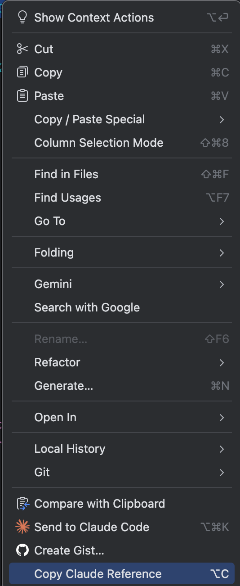

# Copy Claude Reference

에디터에서 **Claude Code 형식**(`@file#Lstart-end`)의 파일 참조를 클립보드에 복사하는 JetBrains IDE 플러그인입니다.

## 왜 이 플러그인을 사용하나요?

[Claude Code](https://docs.anthropic.com/en/docs/claude-code/overview)에서 특정 코드를 참조하려면 `@file#Lstart-end` 형식이 필요합니다.
매번 상대 경로와 라인 번호를 직접 입력하는 대신, 단축키 하나로 자동 생성합니다.

## 기능

| 동작 | 클립보드 결과 |
|------|---------------|
| `src/main/App.kt`의 42번 줄에 커서 | `@src/main/App.kt#L42` |
| `src/main/App.kt`의 10-25번 줄 선택 | `@src/main/App.kt#L10-25` |

- **단일 라인 참조** — 커서 위치의 줄 번호를 자동 포함
- **다중 라인 참조** — 선택 범위의 시작~끝 줄 번호를 자동 포함
- **프로젝트 상대 경로** — 프로젝트 루트 기준 경로 자동 생성
- **우클릭 메뉴** — 에디터 컨텍스트 메뉴에서 "Copy Claude Reference"
- **키보드 단축키** — `Alt+C` (Settings → Keymap에서 변경 가능)

## 설치

### Zip 파일로 설치
1. [Releases](../../releases)에서 최신 zip 파일 다운로드
2. Android Studio / IntelliJ → **Settings → Plugins → ⚙️ → Install Plugin from Disk**
3. 다운로드한 zip 파일 선택 → IDE 재시작

### 소스에서 빌드
```bash
git clone https://oss.navercorp.com/dongsik-kim/copyClaudeReference.git
cd copyClaudeReference
./gradlew buildPlugin
```
빌드 결과: `build/distributions/CopyClaudeReference-1.0.0.zip`

> **참고:** JDK 17이 필요합니다.

## 스크린샷

### 에디터 컨텍스트 메뉴


## 사용 방법

1. 프로젝트의 아무 파일을 엽니다
2. 커서를 원하는 줄에 놓거나, 코드 범위를 선택합니다
3. `Alt+C` 또는 우클릭 → **Copy Claude Reference**
4. Claude Code 대화에 붙여넣기 합니다

## 호환성

- **IDE**: IntelliJ IDEA, Android Studio, WebStorm, PyCharm, GoLand, Rider, CLion, RubyMine 등 모든 JetBrains IDE
- **IDE 버전**: 2024.1 이상

## 라이선스

MIT
